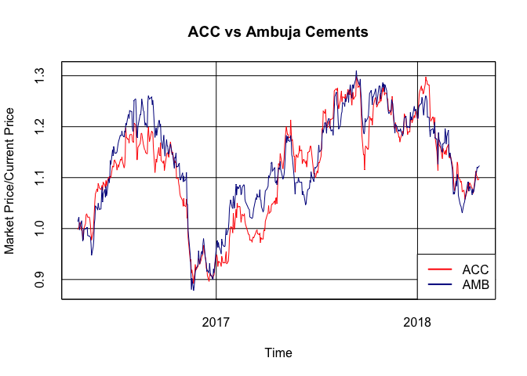

ACC VS AMBUJA CEMENTS
================
Vimal Simha
4/24/2018

Summary
-------

We carry out a comparison between ACC and Ambuja Cements, examining both fundamentals and recent price history. We find that, going forward, ACC stocks are likely to provide better returns than Ambuja Cements stocks. ACC has provided a higher return on capital and is trading at a lower earnings multiple than Ambuja Cements. Furthermore, past price history indicates that ACC has higher upside potential from its current price than Ambuja Cements.

ACC has corrected sharply (~15%) from its highs in Jan 2018, and has just begun to turn the corner. It is available at an attractive price, and hence we advocate buying ACC at or close to current market price.

------------------------------------------------------------------------

Fundamentals
------------

We start our analysis by comparing essential data about the two companies under consideration. Our data are from *Capital Market*. In the table below, Closing Price is yesterday's closing price on the NSE, MCAP is market capitalisation in billions of rupees, P/E is Price/Earnings in the last year, P/BV is Price/Book Value and Sales is total sales in billions of rupees.

| Company        |  Closing Price (Rs)|  MCAP (bn Rs)|  P/E (yrs)|  P/BV|  Sales (bn Rs)|
|:---------------|-------------------:|-------------:|----------:|-----:|--------------:|
| ACC            |             1425.75|        267.74|      29.28|  2.86|         129.31|
| Ambuja Cements |              220.40|        437.64|      34.98|  2.19|         104.47|

Ambuja Cements has a market capitalisation that is more than one and a half times greater than that of ACC. Yet ACC's sales are about 25% more than those of Ambuja Cements.

ACC trades at a smaller earnings multiple compared to Ambuja Cements. Added to the fact that ACC also trades at a higher multiple of book value compared to Ambuja Cements, it follows that ACC is able to generate a higher return on capital employed compared to Ambuja Cements. Both companies have negligible levels of debt (not shown in table).

------------------------------------------------------------------------

### Price Action

We examine prices of the stocks of ACC and Ambuja Cements over the last two years. We plot the closing prices on the NSE against date. To aid comparison, the price of each stock is normalised to its last closing price at the time this was written. In short, yesterday's closing price is 1 for both stocks. Our data are from *Yahoo Finance*.

Both stocks track each other quite closely. Over the last two years, both ACC and Ambuja Cements have risen in value by about 11%. While it is true that Ambuja Cements stocks have provided a higher return than ACC stocks over the last year, the difference in returns is neither significant nor relevant for our purpose. ACC shows a slightly higher level of volatility, although more on the upside than the downside.

The stock price of ACC has corrected significantly from its high in early 2018, but appears to have turned the corner. The story for Ambuja Cements is rather similar, although the magnitude of correction has been smaller. If both stocks were to return to their previous highs, ACC would provide a bigger return than Ambuja Cements.
